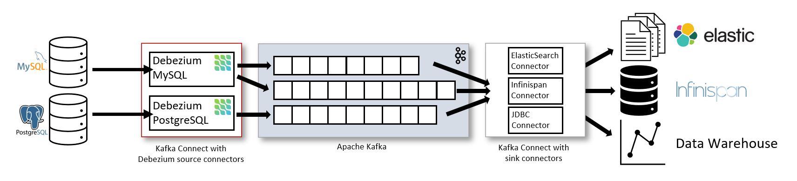

Debezium is a set of distributed services to capture changes in our databases so that our application can see those changes and respond to them (CDC).

I set up a CDC for MySQL, you can reference the setup [here](https://github.com/thachlp/cdc-debezium-service).

When consuming the change events from Kafka, I created a Java application to consume the messages and convert Kafka events to SQL statements.

This approach helps me monitor the results more easily.
You can reference the consumer source code [here](https://github.com/thachlp/cdc-debezium-service/tree/main/cdc-debezium-consumer)

#### Learn more:
https://debezium.io/documentation/reference/2.7/index.html

https://www.infoq.com/presentations/data-streaming-kafka-debezium/
