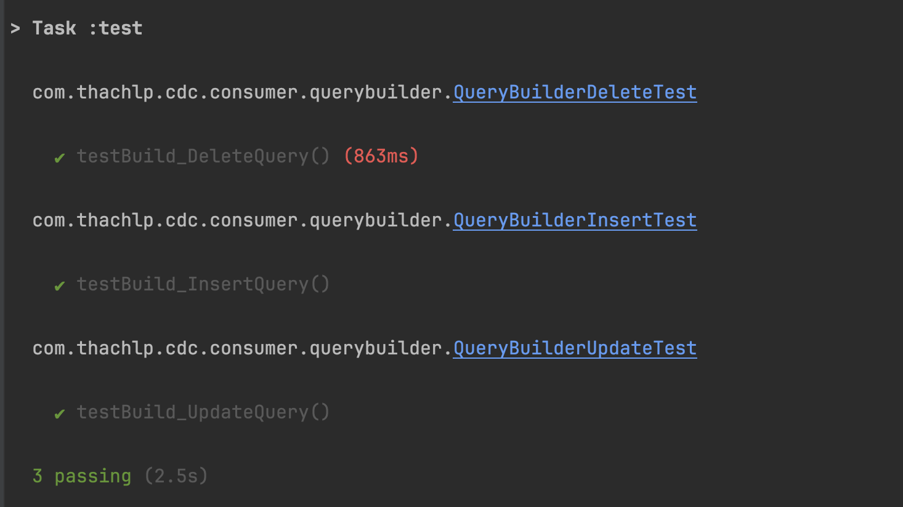

When executing tests in a Gradle project, it is very helpful to see detailed information from the test logs, such as the package name, class, test name, result, and execution time like this:



Setting up the `test-logger` plugin is very simple. Just add the plugin and configuration to your **`build.gradle`** file:

```groovy
    plugins {
        // Check the compatibility with gradle version
        id "com.adarshr.test-logger" version "4.0.0"
    }

    testlogger {
        theme 'mocha'
        slowThreshold 500
    }
```
